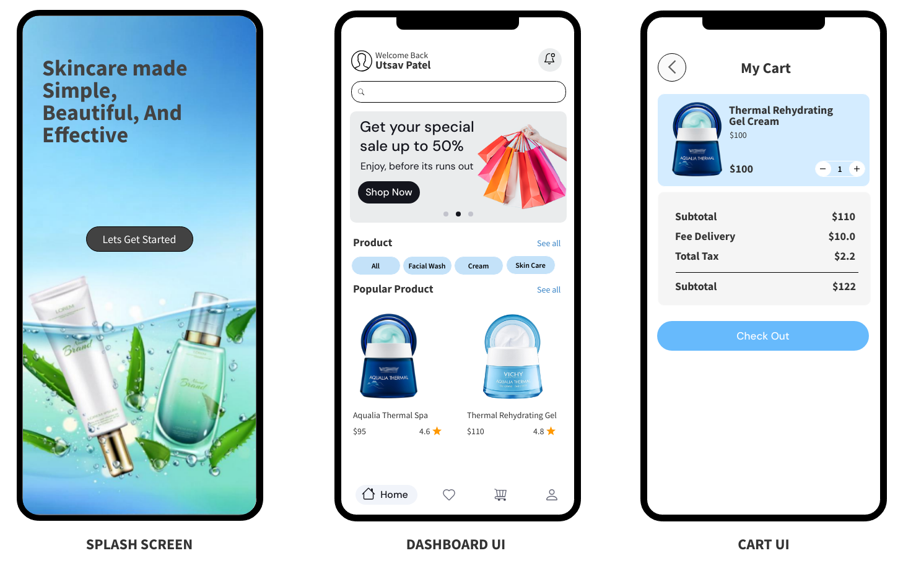

### Quick-Cart

## 🚀 Features

- 📦 Product Listing with category-based filtering  
- 🔖 Banner Carousel from Firebase  
- 🌟 Recommended Products section  
- 🔍 Product Detail with Image Gallery  
- ☁️ Data fetched from Firebase Realtime Database  

---

## 📁 Firebase Database Collections

### 🔹 Banners Collection (`banners`)
| Field | Type   | Description              |
|-------|--------|--------------------------|
| `url` | string | URL to the banner image  |

### 🔹 Categories Collection (`categories`)
| Field   | Type   | Description               |
|---------|--------|---------------------------|
| `id`    | number | Unique ID of the category |
| `title` | string | Name of the category      |

### 🔹 Products Collection (`products`)
| Field           | Type     | Description                                               |
|-----------------|----------|-----------------------------------------------------------|
| `title`         | string   | Name of the product                                       |
| `description`   | string   | Product description                                       |
| `price`         | number   | Price in local currency                                   |
| `rating`        | number   | Product rating (e.g., 4.6)                                |
| `categoryId`    | string   | ID of the linked category                                 |
| `showRecommended`| boolean | Should the product appear in recommended section          |
| `picUrl`        | array    | Array of image URLs for the product gallery               |

---

## ⚙️ Tech Stack

- 💚 **Firebase Realtime Database**
- ⚛️ React Native / Android (if applicable)
- 🧩 JSON-based structured data import
